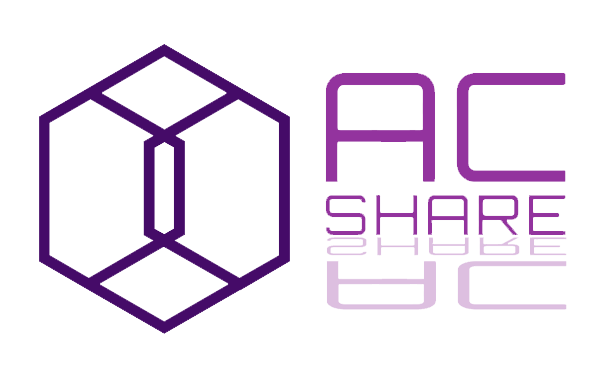

# AC Share



AC Share is a local network file sharing system designed to allow users within the same network to share files offline efficiently and securely. With AC Share, users can easily track who sent which files, enhancing the collaboration and file management within teams or groups.

## Features

- **File Sharing**: Quickly and securely share files across a local network.
- **Offline Support**: Operates entirely offline within your local network environment.
- **File Tracking**: Users can track the files they have sent and received.
- **Simple User Interface**: Easy to use interface for all levels of tech expertise.

## Getting Started

These instructions will guide you on setting up your own instance of AC Share on your local machine for development and testing purposes. Follow these steps to get a copy of the project up and running.

### Prerequisites

Before you begin, ensure you have the following installed:
- [PHP](https://www.php.net/)
- [Composer](https://getcomposer.org/)
- [Laravel](https://laravel.com/docs/installation)
- A web server like Apache or Nginx
- MySQL or any other Laravel supported database server

### Installation

Step by step guide to setting up your local development environment:

1. **Clone the repository:**

   ```bash
   git clone https://github.com/yourusername/file_sharing_systeme.git
2. **Navigate to the project directory:**

   ```bash
   cd file_sharing_systeme
3. **Install dependencies:**

   ```bash
   composer install
4. **Create and configure your environment file:Copy the .env.example file to .env and open it to modify the database and other environment settings:**

   ```bash
   cp .env.example .env
5. **Generate an application key:**

   ```bash
   php artisan key:generate
6. **Run database migrations (it includes seed data):**

   ```bash
   php artisan migrate
7. **Serve the application:**

   ```bash
   php artisan serve

Access the application through the web browser at: http://localhost:8000.

Contributing
Contributions are what make the open-source community such a powerful platform for learning, inspiring, and creating. Any contributions you make are greatly appreciated.

Fork the Project
Create your Feature Branch (git checkout -b feature/AmazingFeature)
Commit your Changes (git commit -m 'Add some AmazingFeature')
Push to the Branch (git push origin feature/AmazingFeature)
Open a Pull Request
License
Distributed under the MIT License. See LICENSE for more information.

Acknowledgments
Hat tip to anyone whose code was used as inspiration.
Big thanks to everyone involved in testing.